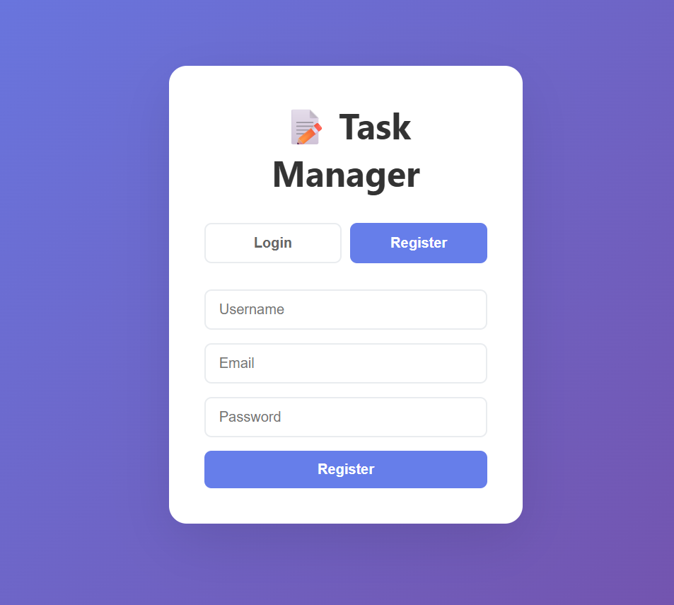
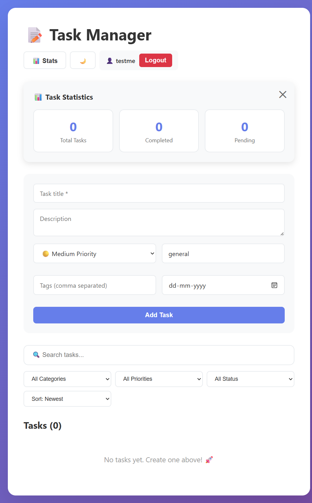

# ✅ Task Manager App (MERN Stack)

A full-stack Task Manager web application built using the MERN Stack (MongoDB, Express.js, React.js, Node.js). It helps users add, update, delete, and track tasks efficiently with secure authentication and database integration.

---

## Demo Account

```
Email: testme@gmail.com
Password: SMILE@1234
```

## 📸 Screenshots

### Login Page


### Task Manager Dashboard


## 🚀 Features

- 🔐 **User Authentication with JWT** - Secure login and registration system
- 📝 **Create, Update, and Delete Tasks** - Full CRUD operations for task management
- 📋 **View All Tasks in Real-Time** - Dynamic task display with live updates
- 💾 **Data Storage with MongoDB Atlas** - Cloud-based database for reliable data persistence
- ⚡ **RESTful API with Express.js** - Well-structured backend API endpoints
- 🖥️ **Modern, Responsive UI built with React.js** - Clean and intuitive user interface
- 🌐 **Fully Deployed** - Frontend on Vercel & Backend on Render

---

## 🧰 Tech Stack

| Layer | Technologies Used |
|-------|-------------------|
| **Frontend** | React.js, Axios, CSS / Tailwind |
| **Backend** | Node.js, Express.js |
| **Database** | MongoDB (Mongoose) |
| **Authentication** | JWT (JSON Web Tokens) |
| **Deployment** | Vercel (Frontend) • Render (Backend) |

---

## 📁 Project Structure
```
task-manager/
│
├── backend/
│   ├── server.js
│   ├── .env
│   └── package.json
│
├── frontend/
│   ├── src/
│   ├── public/
│   ├── .env
│   └── package.json
│
└── README.md
```

---

## ⚙️ Installation & Setup

### Prerequisites
- Node.js (v14 or higher)
- MongoDB Atlas account
- Git

### 1️⃣ Clone the Repository
```bash
git clone https://github.com/Saumyajain0003/task-manager.git
cd task-manager
```

### 2️⃣ Backend Setup
```bash
cd backend
npm install
```

Create a `.env` file in the `backend` folder:
```env
MONGO_URI=your_mongodb_connection_string
JWT_SECRET=your_jwt_secret_key
PORT=5000
```

**Run the backend:**
```bash
npm start
```

The backend runs on `http://localhost:5000`

### 3️⃣ Frontend Setup
```bash
cd frontend
npm install
```

Create a `.env` file in the `frontend` folder:
```env
REACT_APP_API_URL=http://localhost:5000/api
```

For production (after deploying backend):
```env
REACT_APP_API_URL=https://your-backend.onrender.com/api
```

**Run frontend locally:**
```bash
npm start
```

The frontend runs on `http://localhost:3000`

**Build production files:**
```bash
npm run build
```

---

## 🔗 API Endpoints

| Method | Endpoint | Description |
|--------|----------|-------------|
| `POST` | `/api/auth/register` | Register a new user |
| `POST` | `/api/auth/login` | Login user and get JWT token |
| `GET` | `/api/tasks` | Get all tasks (authenticated) |
| `POST` | `/api/tasks` | Create a new task |
| `PUT` | `/api/tasks/:id` | Update an existing task |
| `DELETE` | `/api/tasks/:id` | Delete a task |

---

## 🌐 Deployment Guide

### ✅ Backend Deployment (Render)

1. Go to [Render.com](https://render.com)
2. Click **New** → **Web Service**
3. Connect your GitHub repository (backend folder)
4. Configure the service:
   - **Build Command:** `npm install`
   - **Start Command:** `npm start`
5. Add environment variables:
```
   MONGO_URI=your_mongodb_connection_string
   JWT_SECRET=your_jwt_secret_key
```
6. Click **Deploy**

### ✅ Frontend Deployment (Vercel)

1. Go to [Vercel.com](https://vercel.com)
2. Click **Add New Project**
3. Import your GitHub repository (frontend folder)
4. Add environment variable:
```
   REACT_APP_API_URL=https://your-backend.onrender.com/api
```
5. Vercel auto-detects React settings:
   - **Build Command:** `npm run build`
   - **Output Directory:** `build`
6. Click **Deploy** 🚀

---

## 🎯 How to Use

1. **Register/Login:** Create an account or login with existing credentials
2. **Add Tasks:** Click on "Add Task" to create a new task
3. **Update Tasks:** Click on a task to edit its details
4. **Delete Tasks:** Remove completed or unwanted tasks
5. **View Tasks:** See all your tasks in an organized list

---

## 💡 Future Enhancements

- ⏰ Add due dates and reminders
- 🔔 Push notifications for upcoming deadlines
- 📊 Task analytics and productivity insights
- 🔍 Search and filter functionality

---

## 🤝 Contributing

Contributions are welcome! Please feel free to submit a Pull Request.

1. Fork the repository
2. Create your feature branch (`git checkout -b feature/AmazingFeature`)
3. Commit your changes (`git commit -m 'Add some AmazingFeature'`)
4. Push to the branch (`git push origin feature/AmazingFeature`)
5. Open a Pull Request

---

## 👩‍💻 Author

**Saumya Jain**

- 💻 GitHub: [github.com/Saumyajain0003](https://github.com/Saumyajain0003)
- 🌐 Live App: [task-manager-mern-project-vmgo.vercel.app/](https://task-manager-mern-project-vmgo.vercel.app/)

---

## 🪪 License

This project is licensed under the MIT License — free to use and modify.

---

<div align="center">